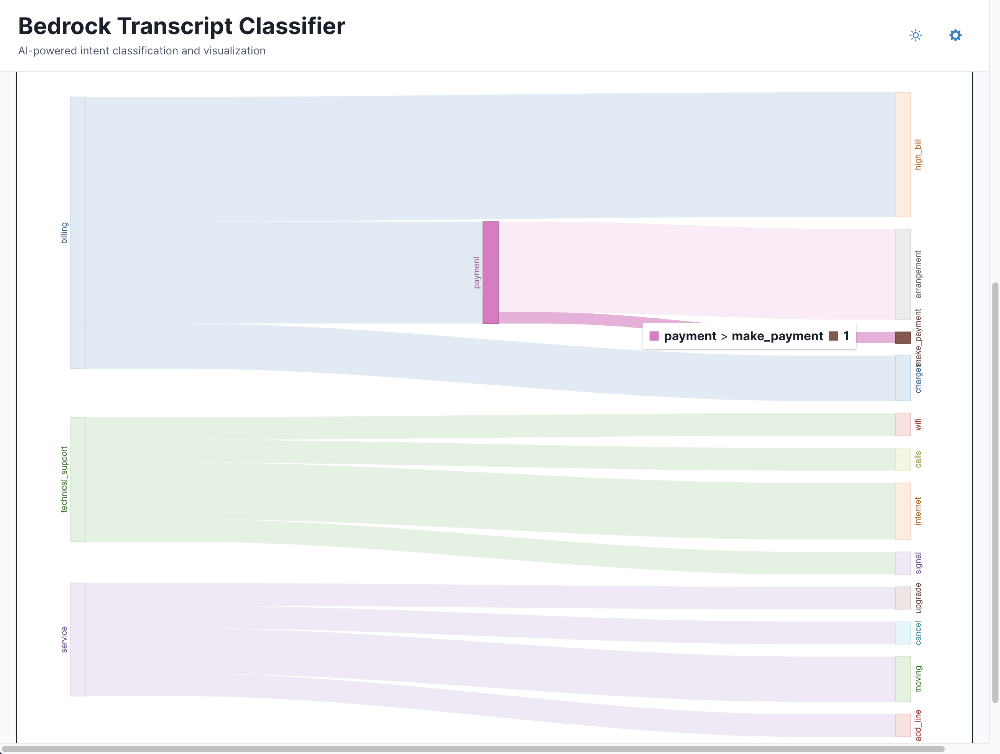

# AgentFlow

<div align="center">


**AI-powered customer service conversation management, automation, and analytics platform**

[](https://aws.amazon.com/cdk/)
[](https://reactjs.org/)
[](https://www.typescriptlang.org/)
[](https://aws.amazon.com/bedrock/)


</div>

## Overview

AgentFlow is a comprehensive AI-powered customer service platform that provides real-time conversation management, intelligent intent detection, automated FAQ responses, and model fine-tuning capabilities. Built on Amazon Bedrock AI, it extracts intent classifications, identifies key parameters, manages conversation flows, and provides interactive visualizations to understand and optimize customer service operations.

### Key Features

- **AI-Powered Classification**: Uses LLM-based intent parsing on Amazon Bedrock to intelligently classify conversation intents
- **Interactive Visualizations**: Sankey diagrams showing conversation flow patterns
- **Parameter Extraction**: Automatically identifies customer-provided and agent-needed parameters
- **Visual Schema Editor**: Drag-and-drop interface for managing intent hierarchies
- **Flow Analytics**: Detailed statistics and insights for each conversation flow
- **Real-time Processing**: Automatic classification triggered by S3 uploads
- **Centralized Configuration System**: Dynamic intent management with web-based configuration interface
- **Redis Session Management**: Real-time conversation state tracking and caching
- **FAQ Management**: Intelligent FAQ responses with trigger phrase matching
- **Model Fine-tuning**: HuggingFace integration for custom model training
- **Conversation Flow Orchestration**: Advanced context switching and parameter collection

## Architecture

### **Backend (AWS CDK)**
- **S3 Bucket**: Stores transcript files and triggers processing
- **Lambda Functions**: AI classification, conversation management, and API handling
- **DynamoDB Tables**: Stores schemas, results, extracted parameters, and FAQ sources
- **API Gateway**: RESTful API for frontend integration with conversation endpoints
- **Amazon Bedrock**: AI model for intent classification and parameter extraction
- **ElastiCache Redis**: Session management, caching, and real-time training status tracking
- **VPC Infrastructure**: Secure networking for Lambda functions and Redis access

### **Frontend (React + TypeScript)**
- **Visual Schema Editor**: Drag-and-drop intent management
- **Sankey Diagrams**: Interactive conversation flow visualization
- **Flow Analytics**: Detailed statistics and parameter analysis
- **Real-time Updates**: Live data synchronization
- **Configuration Manager**: Web-based interface for managing intents, categories, and settings
- **FAQ Manager**: Interactive FAQ response management and testing
- **HuggingFace Fine-tuner**: Model training interface with real-time progress tracking
- **Conversation Tester**: Interactive testing of conversation flows and intent detection

## Screenshots

*Note: The following screenshots showcase the platform's core capabilities including transcript analysis, conversation management, and model training interfaces.*

### Main Dashboard

*The main dashboard showing schema management, and AI suggestions*

### Visual Schema Editor

*Drag-and-drop interface for managing hierarchical intent structures with multi-level support*

### Sankey Flow Visualization

*Interactive Sankey diagram showing conversation flow patterns and frequencies*

### Flow Statistics

*Detailed analytics showing top parameters, conversation counts, and insights for each flow*

### Model Training Interface

*HuggingFace fine-tuning interface with real-time progress tracking and model management*

### Conversation Flow Management

*Interactive conversation testing and flow orchestration with context switching*

## Quick Start

### Prerequisites
- AWS Account with Bedrock access
- Node.js 18+ and npm
- AWS CLI configured

### 1. Clone and Setup
```bash
git clone <repository-url>
cd bedrock-transcript-classifier
```

### 2. Deploy Backend
```bash
cd cdk
npm install
npm run build
npx cdk deploy
```

### 3. Start Frontend
```bash
cd ../frontend/frontend
npm install
npm run dev
```

### 4. Configure API Endpoint
- Open the frontend at `http://localhost:5173`
- Click the settings icon in the header
- Enter your API Gateway URL from the CDK deployment

## API Endpoints

### **Public Endpoints (No Authentication Required)**
- **`/intents`** - Get intent schemas for transcript analysis frontend
- **`/schemas`** - Manage intent schema definitions
- **`/results`** - Access transcript analysis results
- **`/transcripts`** - Transcript management operations

### **Conversation Endpoints (Requires Authentication)**
- **`/conversation`** - Process conversation messages
- **`/conversation/config/*`** - Intent and configuration management
- **`/conversation/finetune/*`** - Model fine-tuning operations
- **`/conversation/testing/*`** - Model testing and evaluation
- **`/conversation/history/*`** - Conversation session management

## Further Documentation

- **[CDK Backend Setup](cdk/README.md)** - Complete backend deployment and configuration
- **[Frontend Development](frontend/frontend/README.md)** - Frontend development and component architecture

## Core Features

### **Intent Classification**
The system automatically classifies conversations into hierarchical intent structures using both rule-based and AI-powered approaches

### **Parameter Extraction**
Automatically identifies two types of parameters:

**Input Parameters** (Customer Provides):
- Account numbers, passwords, addresses
- Personal information for authentication
- Request details and preferences

**Output Parameters** (Agent Needs):
- Backend system data requirements
- Information needed to fulfill requests
- System queries and lookups

### **Centralized Configuration System**
- **Dynamic Intent Management**: Web-based interface for creating, updating, and deleting intents
- **Category Organization**: Hierarchical organization of intents by business domain
- **Response Templates**: Configurable response patterns for each intent
- **Parameter Schemas**: Structured parameter definitions with validation rules
- **FAQ Integration**: Intelligent FAQ responses with confidence scoring

### **Interactive Visualizations**
- **Sankey Diagrams**: Visual representation of conversation flows
- **Click-to-Explore**: Click any node to see detailed statistics
- **Flow Analytics**: Comprehensive metrics for each intent path
- **Parameter Analysis**: Top input/output parameters for each flow

### **Visual Schema Editor**
- **Drag-and-Drop**: Intuitive interface for managing intents
- **Multi-Level Support**: Handle unlimited sub-intent levels
- **JSON Sync**: Bidirectional synchronization with raw JSON
- **Real-time Validation**: Instant feedback on schema structure

### **Conversation Management**
- **Session Tracking**: Redis-powered conversation state management
- **Context Switching**: Intelligent context transitions based on user intent
- **Parameter Collection**: Progressive parameter gathering with validation
- **Response Generation**: Dynamic response creation using configured templates


## Data Flow

### 1. Transcript Upload & Real-time Conversation
- **Transcript Processing**: User uploads a transcript file to the S3 bucket, triggering automatic classification
- **Real-time Conversations**: Users can interact directly with the system for immediate intent detection and response generation
- **Session Management**: Each conversation is tracked with Redis for context persistence and state management

### 2. AI Classification
- The Lambda function sends the transcript text to Amazon Bedrock
- Bedrock analyzes the conversation and determines the intent category and subcategory
- The system stores the classification result with a confidence score

### 3. Parameter Extraction
- The system makes two separate calls to Bedrock for parameter extraction:
  - **Input Parameters**: Identifies information the customer provides (account numbers, passwords, addresses, etc.)
  - **Output Parameters**: Identifies information the agent needs from backend systems (account balances, service status, etc.)

### 4. Data Storage
- Classification results are stored in the `ParsedResultsTable`
- Input parameters are stored in the `InputParametersTable`
- Output parameters are stored in the `OutputParametersTable`
- Each transcript gets a unique ID that links all related data

### 5. Frontend Access
- The React frontend fetches data from the API Gateway
- API Gateway routes requests to the API Lambda function
- The Lambda function queries DynamoDB tables and returns the data
- The frontend displays the data in visualizations (Sankey diagrams, statistics, etc.)

### 6. Configuration Management
- Use the Configuration Manager in the frontend to manage intents, categories, and settings
- All configuration changes are immediately reflected in the conversation system
- FAQ responses can be managed and tested through the FAQ Manager interface
- Intent schemas are automatically synchronized between the configuration system and transcript analysis

## Upcoming Features

- [ ] Handling multiple intents per transcript
- [ ] Cleaning up the schema editor
- [ ] Proper data obfuscation for sensitive data
- [ ] Support for more cloud providers (Azure, GCP, etc.)
- [ ] Cleaner onboarding experience
- [ ] Better error handling
- [ ] Better testing (unit tests, integration tests, etc.)

## IN-PROGRESS

### **Currently In-Progress Features**

#### **RAG (Retrieval-Augmented Generation)**
- **Status**: Partially implemented but disabled
- **Issue**: OpenSearch integration incomplete, vector store not fully operational
- **Current State**: Placeholder endpoints exist but functionality is limited
- **Next Steps**: Complete OpenSearch domain setup and vector embedding pipeline

#### **LangChain Integration**
- **Status**: Simplified implementation in place
- **Issue**: Full LangChain framework not integrated due to Lambda size constraints
- **Current State**: Custom conversation orchestration using simplified patterns
- **Next Steps**: Optimize Lambda packaging or implement lightweight LangChain subset

#### **HuggingFace + LoRA Fine-tuning**
- **Status**: Infrastructure deployed, training simulation active
- **Issue**: Real model training not implemented due to Lambda execution time limits
- **Current State**: Simulated training process with Redis progress tracking
- **Next Steps**: Implement actual HuggingFace API integration or move to ECS/Fargate for training

#### **Advanced Model Management**
- **Status**: Basic model storage and testing implemented
- **Issue**: Model versioning, A/B testing, and production deployment incomplete
- **Current State**: Simple model storage with basic inference testing
- **Next Steps**: Implement model registry, versioning, and deployment pipeline

#### **Real-time Training Pipeline**
- **Status**: Architecture designed, implementation partial
- **Issue**: Continuous learning from conversation feedback not operational
- **Current State**: Manual training job initiation and monitoring
- **Next Steps**: Implement automated feedback collection and incremental training

## License

This project is licensed under the MIT License - see the [LICENSE](LICENSE) file for details.
